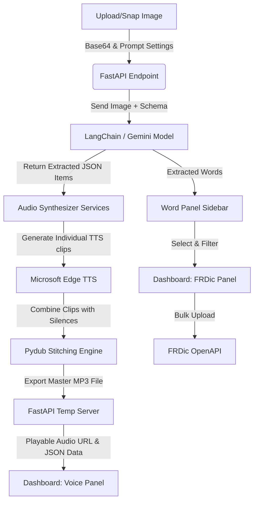
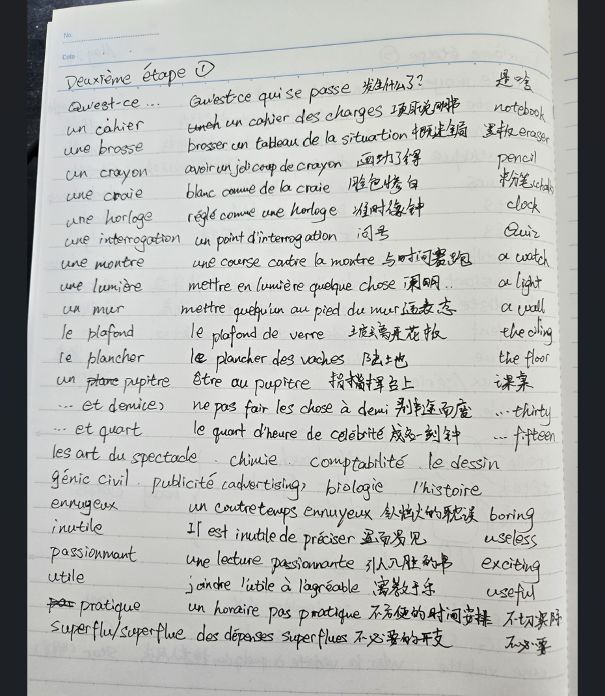

<div align="center">

# 📸 LinguaSnap

### Multilingual Picture-to-Voice & Vocabulary Builder

[](https://www.python.org/)
[](https://fastapi.tiangolo.com/)
[](https://github.com/langchain-ai/langchain)
[](https://deepmind.google/technologies/gemini/)

**Snap a photo of any text and instantly get voice guides, translations, and vocabulary book uploads.**

</div>

---

## 📖 Introduction

**LinguaSnap** is a modern, single-command web application built for language learners, teachers, and auditory students. By snapping a photo or uploading an image of a study guide, LinguaSnap leverages:

1. **Google Gemini (via LangChain)** to perform advanced multimodal OCR, extract vocabularies, sentences, and translations, and automatically detect languages.
2. **Microsoft Edge Neural TTS** to convert each term into highly natural voice recordings in native dialects.
3. **Pydub Audio Stitcher** to automatically assemble the clips into a unified, high-quality audio file (`.mp3`) with customizable timings, playback speeds, and a **Follow-Along (跟读)** repetition mode.
4. **FRDic OpenAPI** to upload extracted words directly to your 法语助手 (French), 欧路词典 (English), 德语助手 (German), or 西语助手 (Spanish) vocabulary books.

Featuring a beautiful **glassmorphic dark-mode interface**, LinguaSnap functions as a complete monorepo served entirely by FastAPI with **zero Node.js/npm dependencies**!

---

## ✨ Core Features

*   📸 **Camera Snap & Upload**: Upload images from local folders or snap picture worksheets instantly using your webcam.
*   🧠 **Gemini Multimodal OCR**: Intelligently identifies and separates language items, translating them or classifying languages (`fr`, `zh`, `en`, `ja`, `es`, etc.) based on your custom prompt instruction.
*   ⏱️ **Follow-Along (跟读) Mode**: Inserts a structured pause interval (current clip duration + 1 second) after each phrase, leaving perfect room for students to repeat out loud.
*   ⚡ **Adjustable Voice Speed**: Speed up or slow down playback (from `0.5x` to `2.0x`) for active auditory training.
*   🎧 **Custom Glass Audio Deck**: A premium, interactive HTML5 audio player supporting real-time scrubbing, custom status indicators, and offline audio downloads.
*   📚 **FRDic Vocabulary Upload**: Upload extracted words directly to your vocabulary books on 法语助手, 欧路词典, 德语助手, or 西语助手 with smart language filtering and quick-select chips.
*   🧭 **Navigation Rail Dashboard**: Clean two-panel dashboard with voice practice and vocabulary upload modes, plus a persistent word list sidebar.
*   🎨 **Premium Dark Mode**: Built with rich glassmorphism panels, vivid HSL color themes, laser scanner loading overlays, and micro-animations.
*   🚀 **Zero Node.js Overhead**: Served statically by Python FastAPI, allowing you to run the entire app with a single terminal command.

---

## 🛠️ Tech Stack

*   **Backend**: [FastAPI](https://fastapi.tiangolo.com/) (Web Server), [LangChain](https://github.com/langchain-ai/langchain) & [LangChain Google GenAI](https://github.com/langchain-ai/langchain-google) (Structured extraction via Gemini), [httpx](https://www.python-httpx.org/) (FRDic API proxy).
*   **Audio Synthesis**: [edge-tts](https://github.com/rany2/edge-tts) (Microsoft Azure Cognitive Services Neural voices), [pydub](https://github.com/jiaaro/pydub) (Audio stitching and silence timing insertion).
*   **Frontend**: HTML5, Vanilla JS, and modern CSS with custom theme properties (Outfit / Plus Jakarta Sans typography).

---

## 🔄 Data & Execution Flow



---

## 📝 Real-World Example

Here is an example showing how LinguaSnap turns a page of handwritten vocabulary notes into a professional listening course.

### 1. Source Document (`examples/2.png`)
The user uploads a handwritten French-Chinese-English vocabulary sheet from their notebook:

<div align="center">
  
</div>

### 2. Extraction & Synthesized Results (`examples/P2.mp3`)
Gemini detects the language blocks and processes them into structured voice segments:

| # | Extracted Language Item | Language Code | TTS Voice | Role / Action |
|---|-------------------------|:---:|-----------|---------------|
| 01 | **Deuxième étape** | `fr` | `fr-FR-DeniseNeural` | Native French speech |
| 02 | **Qu'est-ce qui se passe** | `fr` | `fr-FR-DeniseNeural` | Native French phrase |
| 03 | **发生什么了？** | `zh` | `zh-CN-XiaoxiaoNeural`| Chinese translation |
| 04 | **What's happening** | `en` | `en-US-EmmaNeural` | English definition |

*   **Standard Mode**: Plays each item sequentially, separated by a standard 1-second pause.
*   **Follow-Along (跟读) Mode**: Plays the French phrase `Qu'est-ce qui se passe`, then pauses for `clip duration + 1s` so the student can repeat it, followed by the translation.
*   **Listen to the Output:** [**`examples/P2.mp3`**](examples/P2.mp3).

### 3. Upload to FRDic
After extraction, switch to the **FRDic panel** via the navigation rail, select your target language (e.g. French), pick or create a vocabulary book, and upload the words with one click.

---

## 🚀 Getting Started

### Prerequisites

*   **Python 3.13+**
*   **FFmpeg**: Required by `pydub` for audio stitching.
    *   *Windows*: `winget install Gyan.FFmpeg`
    *   *macOS*: `brew install ffmpeg`
    *   *Linux*: `sudo apt install ffmpeg`

### Configuration

Create a `.env` file in the root folder and add your API keys:

```env
GEMINI_API_KEY="your_gemini_api_key_here"
GEMINI_MODEL="gemini-2.0-flash-lite-preview-02-05"
EUDIC_API_TOKEN="NIS your_frdic_token_here"   # optional, can be entered in-app
PORT=8000
HOST=0.0.0.0
```

Get your FRDic API token at [https://my.frdic.com/OpenAPI/Authorization](https://my.frdic.com/OpenAPI/Authorization) (for 法语助手) or [https://my.eudic.net/OpenAPI/Authorization](https://my.eudic.net/OpenAPI/Authorization) (for 欧路词典).

### Installation & Run

This project uses **uv** for package management:

```bash
# Install dependencies and sync virtual environment
uv sync

# Run the server (development, with hot reload)
uv run python main.py
```

Open your browser and navigate to **`http://localhost:8000`** to experience LinguaSnap!

---

## 📂 Repository Layout

```
linguasnap/
├── main.py                    # FastAPI server entrypoint (serves static frontend)
├── pyproject.toml             # uv configuration metadata
├── uv.lock                    # uv lockfile
├── services/                  # Core Backend Services
│   ├── langchain_service.py   # LangChain OCR & Structured Extraction
│   ├── audio_service.py       # Microsoft Edge TTS synthesis and audio stitching
│   └── frdic_service.py       # FRDic OpenAPI proxy (法语助手/欧路词典)
├── static/                    # Premium Frontend App
│   ├── index.html             # Single-page interface with nav rail dashboard
│   └── globals.css            # Translucent Glassmorphism CSS design system
├── examples/                  # Media Examples
│   ├── banner.png             # App header showcase banner
│   ├── 2.png                  # Example handwritten notebook image
│   └── P2.mp3                 # Example processed output audio guide
├── temp/                      # Folder for runtime stitched audio files (gitignored)
└── CLAUDE.md                  # Developer and Agent architectural design manual
```
