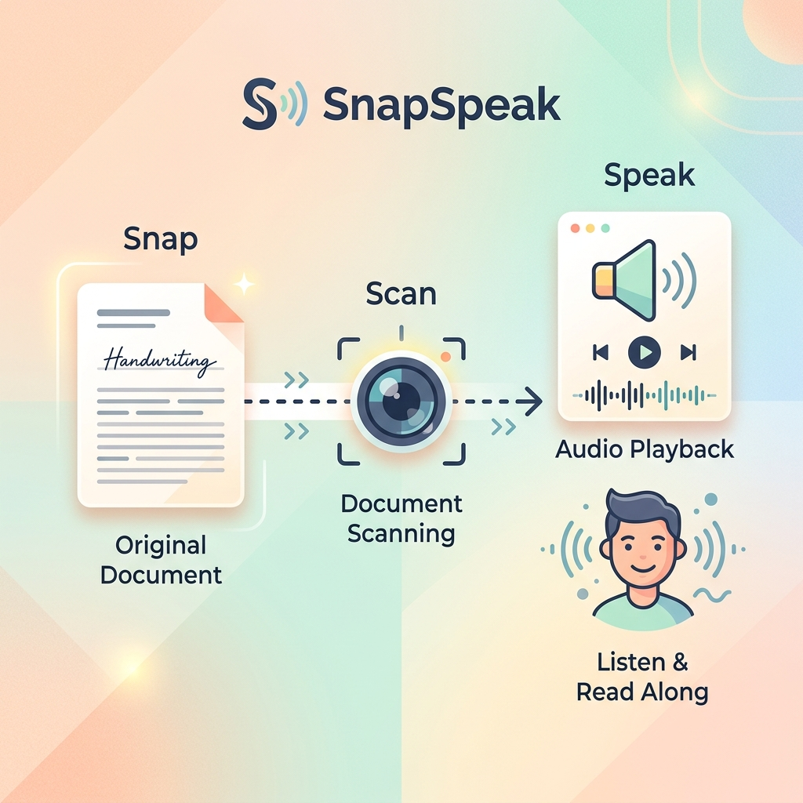
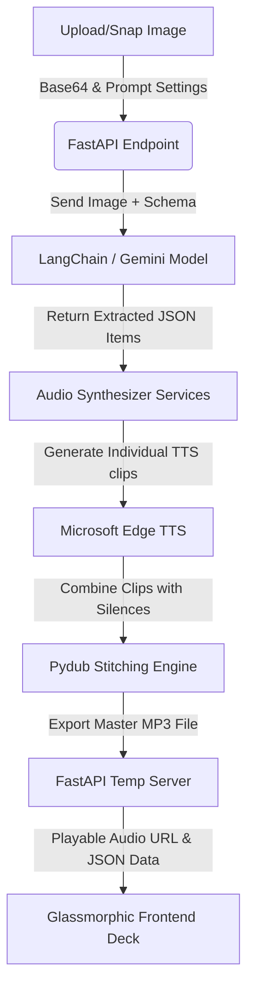

<div align="center">

# 🎙️ SnapSpeak

### Multilingual Picture-to-Voice Practice Guide Generator

[](https://www.python.org/)
[](https://fastapi.tiangolo.com/)
[](https://github.com/langchain-ai/langchain)
[](https://deepmind.google/technologies/gemini/)

**Transform any textbook, handwritten study sheet, or vocabulary list into custom structured audio guides instantly.**



</div>

---

## 📖 Introduction

**SnapSpeak** is a modern, single-command Web application built for language learners, teachers, and auditory students. By snapping a photo or uploading an image of a study guide, SnapSpeak leverages:
1. **Google Gemini (via LangChain)** to perform advanced multimodal OCR, extract vocabularies, sentences, and translations, and automatically detect languages.
2. **Microsoft Edge Neural TTS** to convert each term into highly natural voice recordings in native dialects.
3. **Pydub Audio Stitcher** to automatically assemble the clips into a unified, high-quality audio file (`.mp3`) with customizable timings, playback speeds, and a **Follow-Along (跟读)** repetition mode.

Featuring a beautiful **glassmorphic dark-mode interface**, SnapSpeak functions as a complete monorepo served entirely by FastAPI with **zero Node.js/npm dependencies**!

> [!TIP]
> **Who is SnapSpeak for?**
> SnapSpeak is designed specifically for **language learners** who want to build and study their **own custom word banks**. If you have handwritten vocabulary sheets, textbook screenshots, or custom list exercises and need a **professional audio recording (专业录音) to read along with (跟读)** to perfect your pronunciation, SnapSpeak creates structured custom practice guides for you instantly.

---

## ✨ Core Features

*   📸 **Camera Snap & Upload**: Upload images from local folders or snap picture worksheets instantly using your webcam.
*   🧠 **Gemini Multimodal OCR**: Intelligently identifies and separates language items, translating them or classifying languages (`fr`, `zh`, `en`, `ja`, `es`, etc.) based on your custom prompt instruction.
*   ⏱️ **Follow-Along (跟读) Mode**: Inserts a structured pause interval (current clip duration + 1 second) after each phrase, leaving perfect room for students to repeat out loud.
*   ⚡ **Adjustable Voice Speed**: Speed up or slow down playback (from `0.5x` to `2.0x`) for active auditory training.
*   🎧 **Custom Glass Audio Deck**: A premium, interactive HTML5 audio player supporting real-time scrubbing, custom status indicators, and offline audio downloads.
*   🎨 **Premium Dark Mode**: Built with rich glassmorphism panels, vivid HSL color themes, laser scanner loading overlays, and micro-animations.
*   🚀 **Zero Node.js Overhead**: Served statically by Python FastAPI, allowing you to run the entire app with a single terminal command.

---

## 🛠️ Tech Stack

*   **Backend**: [FastAPI](https://fastapi.tiangolo.com/) (Web Server), [LangChain](https://github.com/langchain-ai/langchain) & [LangChain Google GenAI](https://github.com/langchain-ai/langchain-google) (Structured extraction via Gemini).
*   **Audio Synthesis**: [edge-tts](https://github.com/rany2/edge-tts) (Microsoft Azure Cognitive Services Neural voices), [pydub](https://github.com/jiaaro/pydub) (Audio stitching and silence timing insertion).
*   **Frontend**: HTML5, Vanilla JS, and modern CSS with custom theme properties (Outfit / Plus Jakarta Sans typography).

---

## 🔄 Data & Execution Flow



---

## 📝 Real-World Example

Here is an example showing how SnapSpeak turns a page of handwritten vocabulary notes into a professional listening course.

### 1. Source Document (`examples/2.png`)
The user uploads a handwritten French-Chinese-English vocabulary sheet from their notebook:

<div align="center">
  
</div>

### 2. Extraction & Synthesized Results (`examples/P2.mp3`)
Gemini detects the language blocks and processes them into structured voice segments:

| # | Extracted Language Item | Language Code | TTS Voice | Role / Action |
|---|-------------------------|:---:|-----------|---------------|
| 01 | **Deuxième étape** | `fr` | `fr-FR-DeniseNeural` | Native French speech |
| 02 | **Qu'est-ce qui se passe** | `fr` | `fr-FR-DeniseNeural` | Native French phrase |
| 03 | **发生什么了？** | `zh` | `zh-CN-XiaoxiaoNeural`| Chinese translation |
| 04 | **What's happening** | `en` | `en-US-EmmaNeural` | English definition |

*   **Standard Mode**: Plays each item sequentially, separated by a standard 1-second pause.
*   **Follow-Along (跟读) Mode**: Plays the French phrase `Qu'est-ce qui se passe`, then pauses for `clip duration + 1s` so the student can repeat it, followed by the translation.
*   **Listen to the Output:** You can listen to the resulting stitched course guide audio here: [**`examples/P2.mp3`**](examples/P2.mp3).

---

## 🚀 Getting Started

### Prerequisites

*   **Python 3.9+**
*   **FFmpeg**: Required by `pydub` for audio stitching.
    *   *Windows*: Download from [Gyan.dev](https://www.gyan.dev/ffmpeg/builds/) or run `winget install Gyan.FFmpeg`.
    *   *macOS*: `brew install ffmpeg`
    *   *Linux*: `sudo apt install ffmpeg`

### Configuration

Create a `.env` file in the root folder (or copy from `.env.example`) and add your Google Gemini API key:

```env
GEMINI_API_KEY="your_api_key_here"
GEMINI_MODEL="gemini-flash-lite-latest"
PORT=8000
HOST=0.0.0.0
```

### Installation & Run

Choose one of the setup methods below:

#### Method A: Standard Python (Pip)

1. **Create virtual environment & activate:**
   ```bash
   python -m venv .venv
   
   # On Windows (PowerShell)
   .\.venv\Scripts\Activate.ps1
   # On Windows (Command Prompt)
   .venv\Scripts\activate
   # On macOS/Linux
   source .venv/bin/activate
   ```

2. **Install dependencies:**
   ```bash
   pip install -r requirements.txt
   ```

3. **Run the FastAPI server:**
   ```bash
   python main.py
   ```

#### Method B: Fast Run with `uv`

If you have `uv` installed, setting up and launching the server requires no virtual environment setup:

1. **Sync dependencies:**
   ```bash
   uv pip install -r requirements.txt
   ```

2. **Run the server:**
   ```bash
   uv run python main.py
   ```

Open your browser and navigate to **`http://localhost:8000`** to experience SnapSpeak!

---

## 📂 Repository Layout

```
snapspeak/
├── main.py               # FastAPI server entrypoint (serves static frontend)
├── requirements.txt      # Python dependencies
├── pyproject.toml        # uv configuration metadata
├── uv.lock               # uv lockfile
├── services/             # Core Backend Services
│   ├── langchain_service.py # LangChain OCR & Structured Extraction
│   └── audio_service.py     # Microsoft Edge TTS synthesis and audio stitching
├── static/               # Premium Frontend App
│   ├── index.html        # Single-page interface structure & JS controller
│   └── globals.css       # Translucent Glassmorphism CSS design system
├── examples/             # Media Examples
│   ├── banner.png        # App header showcase banner
│   ├── 2.png             # Example handwritten notebook image
│   └── P2.mp3            # Example processed output audio guide
├── temp/                 # Folder for runtime stitched audio files (gitignored)
└── AGENT.md              # Developers and Agent architectural design manual
```
